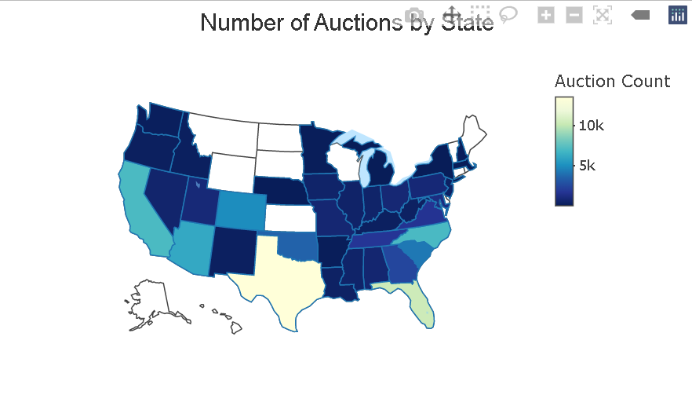
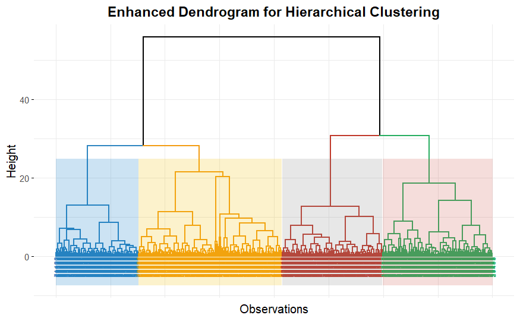

\newpage


```{r setup, include=FALSE}
library(dplyr)
library(ggplot2)
library(corrplot)
library(plotly)
library(GGally)
library(tidyr)
library(plotrix)
library(knitr)
library(htmlwidgets)
library(webshot)
library(arules)
library(factoextra)
library(gridExtra)
library(cluster)
library(readr)
library(caret)
library(pROC)
library(rpart)
knitr::opts_chunk$set(warning = FALSE,echo= FALSE)

test <- read.csv("test.csv")
training <- read.csv("training.csv")

summary(test)
str(test)
data <- training
```


# Data Understanding

The data set is about car auctions in US by the company Carvana in the year 2009-2010. In this report, We outline the steps to analyse the data and understand its quality. Additionally, we even add ways to deal with missing values.

# Data Semantics

The semantics mentioned here are the most important columns used. The columns which are not mentioned are either removed or there name is too obvious to understand.

```{r, echo=FALSE}

field_descriptions <- data.frame(
  Field_Name = c(
    "IsBadBuy", "Auction", "VehYear", "VehicleAge", "Make", 
    "Model", "Color", "Transmission",
    "WheelType", "VehOdo", 
    "MMRAAAP", "MMRAACP", 
    "MMRARAP", "MMRARCP", 
    "MMRCAAP", "MMRCACP", 
    "MMRCRAP", "MMRCRCP", "BYRNO","VNST", "VehBCost", "IsOnlineSale", "WarrantyCost"
  ),
  Definition = c(
    "Indicates whether buying the vehicle was a mistake.",
    "The auction provider where the vehicle was purchased.",
    "The year when the vehicle was manufarured.",
    "Current year - VehYear",
    "The Company of the Vehicle.",
    "The specific model of the vehicle.",
    "The color of the vehicle.",
    "The type of transmission in the vehicle (e.g., Automatic, Manual).",
    "The vehicle's wheel type (eg: Alloys, Cover, Special)",
    "The vehicle's odometer reading at the time of purchase.",
    "The average acquisition price in average condition at the time of purchase.",
    "The acquisition price in above-average condition at the time of purchase.",
    "The retail market acquisition price in average condition at the time of purchase.",
    "The retail market acquisition price in above-average condition at the time of purchase.",
    "The current day acquisition price in average condition at auction.",
    "The current day acquisition price in above-average condition at auction.",
    "The current retail market acquisition price in average condition.",
    "The current retail market acquisition price in above-average condition.",
    "A unique identifier assigned to the buyer who purchased the vehicle.",
    "The state where the vehicle was purchased.",
    "The acquisition cost paid at the time of purchase.",
    "Indicates if the vehicle was originally purchased online.",
    "The cost of a warranty with a term of 36 months and 36,000 miles."
  )
)

# Render the table using kable
kable(field_descriptions, caption = "Car Auction Dataset Field Descriptions")
```

# Data Cleaning

```{r, echo=FALSE}
clean_data <- data %>%
  select(-c(RefId, PurchDate, WheelTypeID, TopThreeAmericanName,
            PRIMEUNIT, AUCGUART,SubModel,Trim,VNZIP1))

mmr_columns <- c("MMRAAAP", "MMRAACP",
                 "MMRARAP", "MMRARCP",
                 "MMRCAAP", "MMRCACP",
                 "MMRCRAP", "MMRCRCP")

indexes<-which(clean_data$WheelType=="NULL")
clean_data$WheelType[indexes]="Unknown"
colnames(clean_data)[13:20] <- mmr_columns
clean_data[mmr_columns] <- lapply(clean_data[mmr_columns], function(x) {
  x[x == "NULL"] <- NA  
  as.numeric(x)         
})
clean_data<-na.omit(clean_data)


clean_data[mmr_columns] <- lapply(clean_data[mmr_columns], function(x) as.numeric(x))

target_variable <- clean_data$IsBadBuy
feature_data <- clean_data %>% select(-IsBadBuy)


numeric_features <- clean_data %>%
  select(where(is.numeric))


```

\begin{itemize}
  \item \textbf{RefId}: This is just a unique identifier and does not provide any meaningful information.
  \item \textbf{PurchDate}: This is redundant information.
  \item \textbf{WheelTypeID}: Information regarding this is already contained in \textit{WheelType}.
  \item \textbf{SubModel} and \textbf{Trim}: Contains too much information, but it is not useful for any data mining activity.
  \item \textbf{TopThreeAmericanName}, \textbf{PRIMEUNIT}, \textbf{AUCGUART}: These columns contained too much missing data.
  \item \textbf{VNZIP1}: The information is already included in \textit{VNST}.
\end{itemize}

To simplify the dataset, the eight \textbf{MMR} columns were renamed using short forms.

```{r, echo=FALSE}

cor_matrix <- cor(numeric_features, use = "complete.obs")
corrplot(cor_matrix, method = "color", tl.cex = 0.8)
```

This correlation plot shows that all the MMRs are strongly correlated (close to 0.9). We used this note-worthy information in the upcoming sections.

\textbf{Data Quality :} 
\begin{itemize}
  \item Consistency checks were applied, and rows containing \texttt{NA} values or missing data were removed.
  \item Clear outliers were deleted. For example, the column \texttt{VehBCost} contained an outlier with a value of \$10.
\end{itemize}

# Exploratory Data Analysis
To assess the relationship between categorical features and the target variable `IsBadBuy`, we performed chi-squared tests. This analysis helps identify significant associations that can guide feature selection for predictive modeling.

```{r, echo=FALSE}
numeric_columns <- colnames(numeric_features)
categorical_features <- clean_data %>%
    select(where(is.character))

cat_test_results <- sapply(colnames(categorical_features), function(col) {
    chisq.test(table(clean_data[[col]], clean_data$IsBadBuy), simulate.p.value = TRUE)$p.value
})

cat_test_results_df <- data.frame(
    Variable = names(cat_test_results),
    P_Value = round(cat_test_results, 4),
    Interpretation = ifelse(cat_test_results < 0.05, "Significant", "Not Significant")
)
kable(cat_test_results_df, caption = "Chi-Squared Test Results for Categorical Features")

```
We found that \textit{Transmission} does not show significant relationship (p-value = 0.7921)

To evaluate the relationship between numeric features and the target variable `IsBadBuy`, we conducted two-sample t-tests for each numeric column. This helps identify whether there are statistically significant differences in the means of numeric variables across the levels of `IsBadBuy`.

```{r, echo=FALSE}
non_constant_columns <- numeric_columns[sapply(clean_data[numeric_columns], function(col) {
  var(col, na.rm = TRUE) > 0
})]

num_test_results <- sapply(non_constant_columns, function(col) {
  tryCatch({
    t.test(clean_data[[col]] ~ clean_data$IsBadBuy)$p.value
  }, error = function(e) {
    NA  # Handle potential errors
  })
})

num_test_results_df <- data.frame(
  Variable = names(num_test_results),
  P_Value = round(num_test_results, 4),
  Interpretation = ifelse(num_test_results < 0.05, "Significant", "Not Significant")
)

kable(num_test_results_df, caption = "T-Test Results for Numeric Features")
```

We found \textit{IsOnlineSale} is not having significant relationship

Next, we look for bar chart for top 10 buyers ranked by highest proportion of bad purchases. Some buyers have relatively higher proportion of bad purchases compared to others. We analyse the trend of these bad buyers. 

```{r,echo=FALSE}
top_buyers <- clean_data %>%
  count(BYRNO) %>%
  arrange(desc(n)) %>%
  head(10) %>%
  pull(BYRNO)

top_buyers_data <- clean_data %>%
  filter(BYRNO %in% top_buyers)

buyer_proportions <- top_buyers_data %>%
  group_by(BYRNO) %>%
  summarize(
    total_purchases = n(),
    isbadbuy_1_count = sum(IsBadBuy == 1),
    proportion_isbadbuy_1 = isbadbuy_1_count / total_purchases
  )

buyer_proportions <- buyer_proportions %>%
  arrange(desc(proportion_isbadbuy_1))

buyer_proportions$BYRNO <- factor(buyer_proportions$BYRNO, levels = buyer_proportions$BYRNO)


ggplot(buyer_proportions, aes(x = BYRNO, y = proportion_isbadbuy_1)) +
  geom_bar(stat = "identity", fill = "skyblue") +
  labs(
    title = "Proportion of Bad Buys (IsBadBuy == 1) for Top 10 Buyers",
    x = "Buyer",
    y = "Proportion of Bad Buys"
  ) +
  theme_minimal() +
  theme(axis.text.x = element_text(angle = 45, hjust = 1))

```
To understand the attribute VSNT, we plotted the map of USA with this variable. 

```{r, echo=FALSE}
tmp <- as.data.frame(table(clean_data$VNST))
colnames(tmp) <- c("VNST", "value")  
fig <- plot_ly(
  data = tmp,
  type = "choropleth",
  locations = ~VNST,
  z = ~value,
  locationmode = "USA-states",
  colorscale = "YlGnBu",
  colorbar = list(
    title = "Auction Count",
    tickprefix = "",
    thickness = 15,
    len = 0.5,
    xpad = 10
  )
)

fig <- fig %>% layout(
  title = list(
    text = "Number of Auctions by State",
    font = list(
      size = 20,
      family = "Arial, sans-serif",
      color = "#333333"
    ),
    x = 0.5
  ),
  geo = list(
    scope = "usa",
    projection = list(type = "albers usa"),
    showlakes = TRUE,
    lakecolor = "rgba(127,205,255,0.5)",
    bgcolor = "rgba(0,0,0,0)"  
  ),
  margin = list(t = 50, b = 20)  
)
```


Interestingly, we found that major auctions took place in only few states. There were many states that had 0 auctions (for eg: Montana).

To check this further we created a bar chart of states v/s auctions. We We found the most of the auctions took place in Texas, Florida and California.

```{r, echo=FALSE, fig.height=5.0}

tmp$VNST <- factor(tmp$VNST, levels = tmp$VNST[order(-tmp$value)])

ggplot(data = tmp, aes(x = VNST, y = value)) +
  geom_bar(stat = "identity", fill = "steelblue") +
  labs(
    title = "Count of Auctions by State",
    x = "State (VNST)",
    y = "Auction Count"
  ) +
  theme_minimal() +
  theme(
    plot.title = element_text(size = 16, face = "bold", hjust = 0.5),
    axis.title.x = element_text(size = 12),
    axis.title.y = element_text(size = 12),
    axis.text.x = element_text(angle = 45, hjust = 1)
  )
```

Then, We explored about the \textit{VehBcost, WarrantyCost, Make}.

```{r, echo=FALSE,out.width="60%",fig.align='center'}

x <- clean_data %>%
  group_by(Make) %>%
  summarize(mean_WarrantyCost = mean(WarrantyCost, na.rm = TRUE)) %>%
  pull(mean_WarrantyCost)

# Calculate mean VehBCost by Make
y <- clean_data %>%
  group_by(Make) %>%
  summarize(mean_VehBCost = mean(VehBCost, na.rm = TRUE)) %>%
  pull(mean_VehBCost)

# Calculate counts by Make, scaled down
z <- clean_data %>%
  group_by(Make) %>%
  tally() %>%
  mutate(size = n / 100) %>%
  pull(size)

# Get the names of each unique Make
names <- clean_data %>%
  group_by(Make) %>%
  tally() %>%
  pull(Make)

# Create a random color scale for each Make
colors <- sample(0:2000, length(z), replace = TRUE)

# Plotly scatter plot
fig <- plot_ly() %>%
  add_trace(
    x = ~x,
    y = ~y,
    type = 'scatter',
    mode = 'markers+text',
    text = ~names,
    textposition = "middle center",
    marker = list(
      size = z,
      color = colors,
      colorscale = "Rainbow",
      showscale = TRUE
    )
  ) %>%
  layout(
    title = "COMPANY PLOT",
    xaxis = list(
      title = "VehBCost",
      type = "log"
    ),
    yaxis = list(
      title = "WarrantyCost"
    )
  )
htmlwidgets::saveWidget(fig, "company_plot.html")  # Save as HTML first
webshot::webshot("company_plot.html", "company_plot.png")  # Save as PNG

```

We see 2 clusters, one around low \textit{VehBcost} and other around mid -range \textit{VehBcost}. Economical brands like **Hyundai**, **Toyota**, and **Mitsubishi** offer vehicles with lower acquisition costs and moderate warranty costs, catering to budget-conscious buyers. Luxury brands like **Cadillac** and **Lexus** are associated with higher acquisition and warranty costs, suggesting their premium status. Brands like **Chevrolet** and **Pontiac** dominate the mid-range segment, likely due to higher vehicle sales or activity.

Next, we explored about the most important variable \textit{IsBadBuy}.

```{r, echo=FALSE, fig.height=4.5}
ggplot(data = clean_data, aes(x = factor(IsBadBuy), fill = factor(IsBadBuy))) +
  geom_bar(width = 0.7, color = "black") +
  geom_text(
    stat = "count",
    aes(label = after_stat(count)),  # Updated to use after_stat(count)
    vjust = -0.5,
    color = "black",
    size = 3.5
  ) +
  scale_fill_manual(values = c("#4CAF50", "#FF7043")) + # Customize colors
  labs(
    title = "Distribution of IsBadBuy",
    x = "IsBadBuy",
    y = "Count",
    fill = "IsBadBuy"
  ) +
  theme_minimal() +
  theme(
    plot.title = element_text(size = 16, face = "bold", hjust = 0.5),
    axis.title.x = element_text(size = 12),
    axis.title.y = element_text(size = 12),
    axis.text.x = element_text(size = 10),
    legend.position = "none"
  )
```

The plot clearly shows the significant class imbalance in the *IsBadBuy*. This may make ML models to show biasness towards predicting the majority class. (We used techniques like SMOTE to tackle this problem)


Next we check the attribute *color*. Starting with the distribution of color.

```{r, echo=FALSE, fig.width=6, fig.height=2}
color_counts <- clean_data %>%
  filter(!is.na(Color)) %>%  # Remove any missing color values
  count(Color)  # Count the occurrences of each color

ggplot(color_counts, aes(x = "", y = n, fill = Color)) +
  geom_bar(stat = "identity", width = 1) +
  coord_polar(theta = "y") +
  labs(title = "Color Distribution", x = "", y = "") +
  theme_void() +  # Remove background and axis
  theme(legend.title = element_blank())

```

As this could be an important indicator, we look for more plots for *color* attribute.

```{r, echo=FALSE}

pclass_xt <- table(clean_data$VehYear, clean_data$Color)
pclass_df <- as.data.frame(pclass_xt)

ggplot(pclass_df, aes(x = Var2, y = Freq, fill = Var1)) +
  geom_bar(stat = "identity", position = "stack") +
  labs(
    title = "Stacked Bar Plot of VehYear and Color",
    x = "Color",
    y = "Count",
    fill = "VehYear"
  ) +
  theme(axis.text.x = element_text(angle = 45, hjust = 1))

```

The stacked bar plot shows that **White**, **Silver**, and **Black** are the most dominant vehicle colors, consistently popular across all years (2001–2010). Bright colors like **Yellow**, **Orange**, and **Purple** are rare, indicating limited demand or production for these colors. Older vehicles (2001–2003) contribute less overall, reflecting fewer auctions for these models. Some categories, such as **Not Available** and **NULL**, highlight missing or incomplete data. The consistent popularity of neutral colors suggests strong customer preferences for classic, universally appealing vehicle tones.

**Exploring the MMR variables**

```{r, echo=FALSE,fig.width=6, fig.height=2.5}
boxplot_data <- clean_data %>%
  select(MMRAAAP, MMRARAP, MMRAACP, MMRARCP) %>%
  pivot_longer(cols = everything(), names_to = "Variable", values_to = "Value")

ggplot(boxplot_data, aes(x = Variable, y = Value, fill = Variable)) +
  geom_boxplot() +
  labs(title = "Boxplot of Selected Columns", x = "Variables", y = "Values") +
  theme_minimal() +
  theme(legend.position = "none")

```
The boxplot reveals that the selected variables (**MMRAAAP**, **MMRAACP**, **MMRARAP**, **MMRARCP**) have similar distributions, with most values concentrated around the lower range but with significant outliers extending beyond 30,000.


```{r, echo=FALSE,fig.width=6, fig.height=4}

plot_data <- clean_data %>%
  select(MMRCAAP, MMRAACP, MMRAAAP, MMRARAP, MMRCRAP, MMRARCP, MMRCACP, MMRCRCP) %>%
  pivot_longer(cols = everything(), names_to = "Variable", values_to = "Value")

ggplot(plot_data, aes(x = Value, color = Variable)) +
  geom_density() +
  xlim(-2500, 20200) +
  labs(title = "Kernel Density Estimates for Selected Columns",
       x = "Value",
       y = "Density") +
  theme_minimal() +
  theme(legend.title = element_blank())

```

We found MMR attributes are very correlated, and the correlation is even higher when consider these pair wise. Further, we noticed before the cleaning, the presence of a peak at 0. We will treat this value as missing value.

Checking the same trend in MMR current day prices. 

```{r, echo=FALSE,fig.width=6, fig.height=3}
boxplot_data <- clean_data %>%
  select(MMRCAAP, MMRCACP, MMRCRAP, MMRCRCP) %>%
  pivot_longer(cols = everything(), names_to = "Variable", values_to = "Value")

# Create the boxplot
ggplot(boxplot_data, aes(x = Variable, y = Value, fill = Variable)) +
  geom_boxplot() +
  labs(title = "Boxplot of Selected Columns", x = "Variables", y = "Values") +
  theme_minimal() +
  theme(legend.position = "none")

```

We see a similar trend in MMR current prices and MMR acquisition price. Even this shows a correlation between these 2 variables.

# Clustering

We use **k-means clustering** and **hierarchical clustering** to group observations based on their similarities in selected features.

The clustering is based on the following columns:

- VehOdo
- VehBCost
- WarrantyCost
- MMRAcquisitionAuctionAveragePrice
- MMRAcquisitionRetailAveragePrice

The data is also standardized (z-scores) before performing clustering to obtain consistent and reasonable inference from the formed clusters.

```{r, echo=FALSE}

data_selected <- clean_data %>% 
  select(VehOdo, VehBCost, WarrantyCost,
         MMRAAAP,
         MMRARAP
  )
data_selected <- data_selected %>%
  mutate(across(everything(), as.numeric)) %>%
  na.omit()

data_z_scaled <- as.data.frame(scale(data_selected))
```

## K-Means Clustering

The ideal number of clusters ($k$) is evaluated using the elbow plot where we plot the total within cluster sum of squares (WSS) against $k$. The clustering is performed for $k = 2-10$. As a result, we see an

```{r kmeans_clust, warning=FALSE, fig.width=5, fig.height=4, fig.align='center',echo=FALSE}
wss <- sapply(2:10, function(k) {
  kmeans(data_z_scaled, centers = k, nstart = 25)$tot.withinss
})

plot(2:10, wss, type = "b", pch = 19, frame = FALSE,
     xlab = "Number of clusters K",
     ylab = "Total within-clusters sum of squares (Z-Scaled Dataset)"
)
```
From the plot, we identify $k=3$ as the best number of clusters. Based on this, we create clusters and plot them as a function of 2 parameters at a time.

```{r, warning=FALSE, echo=FALSE, fig.height=3.5, fig.width=8}
kmeans_result <- kmeans(data_z_scaled, centers = 3, nstart = 25)

# Visualize KMeans clusters in pairs of two variables
pairs <- combn(names(data_z_scaled), 2, simplify = FALSE)

# Function to plot clusters for each pair
plot_clusters <- function(var1, var2) {
  p <- ggplot(data_z_scaled, aes_string(x = var1, y = var2, color = as.factor(kmeans_result$cluster))) +
    geom_point() +
    labs(title = paste("Clusters based on", var1, "and", var2),
         color = "Cluster") +
    theme_minimal()
  print(p)
}

# Plot all pairs
for (pair in pairs){
  plot_clusters(pair[1], pair[2])
}
```
## Hierarchical Clustering

Since the data is very large, the distance matrix for the original dataset requires a lot of memory and time to run. Instead, we consider 1000 data points sampled from the dataset to try and evaluate any interesting features.
```{r eval = FALSE}
data_sample <- data_z_scaled[sample(nrow(data_z_scaled), 1000), ]

# Recalculate the distance matrix and perform hierarchical clustering on the sample
dist_matrix <- dist(data_sample, method = "euclidean")
hclust_result <- hclust(dist_matrix, method = "ward.D2")

# Plot the dendrogram with the sampled data
fviz_dend(hclust_result, k = 4, rect = TRUE, rect_border = "jco", rect_fill = TRUE, cex = 0.5,
          lwd = 0.7, k_colors = c("#2E86C1", "#F39C12", "#C0392B", "#27AE60"),
          ggtheme = theme_minimal(), main = "Enhanced Dendrogram for Hierarchical Clustering",
          xlab = "Observations", ylab = "Height") +
  theme(plot.title = element_text(hjust = 0.5, face = "bold", size = 14),
        axis.title = element_text(size = 12))

```



# Classification

## Data Processing
The data was standardized using Z-score normalization and PCA was applied to reduce dimensionality. The first principal component (PC1) was extracted to represent the combined effect of MMRA and MMRC-related variables, simplifying the dataset while retaining key information. 

```{r, echo=FALSE}
clean_data2<-clean_data
mmr_data <- scale(clean_data2[, mmr_columns], center = TRUE, scale = TRUE)

pca <- prcomp(mmr_data, center = TRUE, scale. = TRUE)
pca_data <- as.data.frame(pca$x[, 1])
colnames(pca_data) <- 'MMRAC_PC1'
clean_data3<-clean_data
clean_data3 <- clean_data3 %>%
  dplyr::select(-all_of(mmr_columns)) %>%
  bind_cols(pca_data)

clean_data3$VehBCost <- scale(clean_data3$VehBCost)[,1]
clean_data3$VehOdo <- scale(clean_data3$VehOdo)[,1]
clean_data3$WarrantyCost <- scale(clean_data3$WarrantyCost)[,1]


# Convert character columns to numeric
for (col in names(clean_data3)) {
  if (is.character(clean_data3[[col]])) {
    clean_data3[[col]] <- as.numeric(factor(clean_data3[[col]]))
  }
}


X <- clean_data3 %>% dplyr::select(-IsBadBuy)
y <- as.factor(clean_data3$IsBadBuy)
levels(y) <- c("No", "Yes")

trainIndex <- createDataPartition(y, p = 0.8, list = FALSE)
X_train <- X[trainIndex, ]
y_train <- y[trainIndex]
X_test <- X[-trainIndex, ]
y_test <- y[-trainIndex]

# Create upsampled and downsampled training data
up_train <- upSample(x = X_train, y = y_train)
down_train <- downSample(x = X_train, y = y_train)

```
## Model Training and Evaluation

The `train_and_evaluate()` function is a comprehensive utility for training and assessing the performance of classification models. It employs **5-fold Cross-Validation** (CV), a robust evaluation technique that divides the training data into five subsets (folds) to ensure the model is validated on multiple segments of the dataset, reducing the risk of overfitting. The function utilizes the `caret::train()` method to train the specified model, using `ROC` as the evaluation metric for model selection. It then generates probabilistic predictions on the test set and converts them to binary class labels using a threshold of 0.5. The evaluation step involves computing a confusion matrix, from which key metrics are derived: overall accuracy, Good Buy accuracy (for non-defective cars), and Bad Buy accuracy (for defective cars). This function standardizes the model evaluation process, enabling consistent and interpretable comparisons across different models and data resampling techniques.

```{r}
# Function to train and evaluate models, including confusion matrix printing
train_and_evaluate <- function(model_method, train_data, test_data, test_labels) {
  model <- train(Class ~ ., data = train_data, method = model_method, metric = "ROC",
                 trControl = trainControl(method = "cv", number = 5, classProbs = TRUE, summaryFunction = twoClassSummary))
  
  prob_predictions <- predict(model, newdata = test_data, type = "prob")[, 2]
  class_predictions <- ifelse(prob_predictions > 0.5, "Yes", "No")
  
  # Calculate metrics
  conf_matrix <- confusionMatrix(as.factor(class_predictions), test_labels)
  print(conf_matrix$table)
  
  accuracy <- conf_matrix$overall["Accuracy"]
  good_buy_accuracy <- conf_matrix$table[1, 1] / sum(conf_matrix$table[, 1])
  bad_buy_accuracy <- conf_matrix$table[2, 2] / sum(conf_matrix$table[, 2])

  list(accuracy = accuracy,good_buy_accuracy = good_buy_accuracy, bad_buy_accuracy = bad_buy_accuracy)
  
}
```

## LDA

LDA aims to find a linear combination of features that best separates the classes by maximizing the distance between the class means while minimizing the variance within each class.

```{r, echo=TRUE}
# LDA for normal, upsampled, and downsampled data
lda_normal <- train_and_evaluate("lda", data.frame(X_train, Class = y_train), 
                                 X_test, y_test)
lda_up <- train_and_evaluate("lda", up_train, X_test, y_test)
lda_down <- train_and_evaluate("lda", down_train, X_test, y_test)
```

## QDA

QDA is similar to LDA but relaxes the assumption of equal covariance matrices for each class. It allows each class to have its own covariance matrix, resulting in a quadratic decision boundary.

```{r, echo=TRUE}
# QDA for normal, upsampled, and downsampled data
qda_normal <- train_and_evaluate("qda", data.frame(X_train, Class = y_train), 
                                 X_test, y_test)
qda_up <- train_and_evaluate("qda", up_train, X_test, y_test)
qda_down <- train_and_evaluate("qda", down_train, X_test, y_test)
```

## Decision Tree

A Decision Tree is a non-parametric, tree-structured model that splits the data into subsets based on feature values. At each node, the tree selects the feature and threshold that best separates the classes using a criterion like **Gini impurity** or **information gain**. The tree continues splitting until a stopping condition is met, making it interpretable and useful for both classification and regression tasks.

```{r, echo=TRUE}
# Decision Tree for normal, upsampled, and downsampled data
dt_normal <- train_and_evaluate("rpart", data.frame(X_train, Class = y_train), 
                                X_test, y_test)
dt_up <- train_and_evaluate("rpart", up_train, X_test, y_test)
dt_down <- train_and_evaluate("rpart", down_train, X_test, y_test)
```

## Results Summary

```{r}
# Combine results into a summary table
results <- data.frame(
  Model = c("Decision Tree - Normal", "Decision Tree - Upsampled", "Decision Tree - Downsampled",
            "LDA - Normal", "LDA - Upsampled", "LDA - Downsampled",
            "QDA - Normal", "QDA - Upsampled", "QDA - Downsampled"),
  Accuracy = c(dt_normal$accuracy, dt_up$accuracy, dt_down$accuracy,
                        lda_normal$accuracy, lda_up$accuracy, lda_down$accuracy,
                        qda_normal$accuracy, qda_up$accuracy, qda_down$accuracy),
  Good_Buy_Accuracy = c(dt_normal$good_buy_accuracy, dt_up$good_buy_accuracy, dt_down$good_buy_accuracy,
                        lda_normal$good_buy_accuracy, lda_up$good_buy_accuracy, lda_down$good_buy_accuracy,
                        qda_normal$good_buy_accuracy, qda_up$good_buy_accuracy, qda_down$good_buy_accuracy),
  Bad_Buy_Accuracy = c(dt_normal$bad_buy_accuracy, dt_up$bad_buy_accuracy, dt_down$bad_buy_accuracy,
                       lda_normal$bad_buy_accuracy, lda_up$bad_buy_accuracy, lda_down$bad_buy_accuracy,
                       qda_normal$bad_buy_accuracy, qda_up$bad_buy_accuracy, qda_down$bad_buy_accuracy)
)

# Print the results table
knitr::kable(results, caption = "Class-wise Accuracy Metrics")

```

**Key Takeaways**:

-   The models generally performed well in predicting "Good Buy" (non-defective cars), with **Decision Tree (Normal)** achieving the highest Good Buy accuracy of **99.3%**

-   Predicting "Bad Buy" (defective cars) was challenging across all models, with the highest accuracy observed in **Decision Tree (Upsampled)** and **Decision Tree (Downsampled)**, achieving around **69%**.

-   **Upsampling** and **downsampling** led to significant improvements in Bad Buy accuracy at the expense of slightly reduced Good Buy accuracy.

-   If the primary focus is on identifying non-defective cars (Good Buys), then **Decision Tree (Normal)** is the best choice.

-   If equal importance is to be given to both Bad Buy and Good Buys then upsampled LDA or QDA will be better.

# Association Rule Minning

## Data Preprocessing

The data was standardized using Z-score normalization and PCA was applied to reduce dimensionality. The first principal component (PC1) was extracted to represent the combined effect of MMRA and MMRC-related variables, simplifying the dataset while retaining key information.

```{r, echo=FALSE}
summary(pca)
```
Continuous variables such as PC1, VehOdo, VehBCost, and WarrantyCost were discretized into bins using the cut() function to create categorical data, a requirement for association rule mining.

```{r, echo=FALSE}
pca_data <- as.data.frame(pca$x[, 1])
colnames(pca_data) <- 'PC1'
clean_data2 <- clean_data2 %>%
  dplyr::select(-all_of(mmr_columns)) %>%
  bind_cols(pca_data)


clean_data2 <- dplyr::select(clean_data2, c(VehicleAge,Make,Model,Color,WheelType,VehOdo,PC1,BYRNO,VNST,VehBCost,WarrantyCost,IsBadBuy))
clean_data2$PC1 <- cut(clean_data2$PC1, breaks = 5)
clean_data2$VehOdo <- cut(clean_data2$VehOdo, breaks = 5)
clean_data2$VehBCost <- cut(clean_data2$VehBCost, breaks = 5)
clean_data2$WarrantyCost <- cut(clean_data2$WarrantyCost, breaks = 5)

categorical_columns <- c("VehicleAge", "Make", "Model", "Color", "WheelType", "BYRNO", "VNST", "IsBadBuy")
clean_data2[categorical_columns] <- lapply(clean_data2[categorical_columns], as.factor)
trans <- as(clean_data2, "transactions")
summary(trans)
```

```{r, echo=FALSE,results="hide"}
rules <- apriori(trans, parameter = list(supp = 0.1, conf = 0.8))

bad_buy_rules <- subset(rules, rhs %in% "IsBadBuy=1")
good_buy_rules <- subset(rules, rhs %in% "IsBadBuy=0")
rules_metrics <- data.frame(
  support = quality(rules)$support,
  confidence = quality(rules)$confidence,
  lift = quality(rules)$lift
)

```
All relevant columns were converted to factors to ensure compatibility with the arules package.

```{r, echo=FALSE}
ggplot(rules_metrics, aes(x = confidence)) +
  geom_histogram(bins = 20, fill = "steelblue", color = "black") +
  labs(
    title = "Distribution of Confidence",
    x = "Confidence",
    y = "Number of Rules"
  ) +
  theme_minimal()

```

## No Bad Buy Rules Found
- The dataset contained no strong rules predicting `{IsBadBuy=1}`. This suggests that the "bad buy" patterns are either too rare or not strongly associated with specific attribute combinations.

## Good Buy Patterns
- Vehicles with **WheelType = Covers**, high **PC1 values**, and very low **VehBCost** are strongly associated with being good buys. For example:
  - `{WheelType=Covers, PC1=High, VehBCost=Very Low} → {IsBadBuy=0}`  
    *Confidence = 0.95, Lift = 1.08*.
- Vehicles with **newer ages** (e.g., `VehicleAge = 2 or 3`) and specific makes (e.g., **CHEVROLET**) with attributes like `WheelType = Covers` tend to be good buys:
  - `{VehicleAge=2} → {IsBadBuy=0}`  
    *Confidence = 0.936, Lift = 1.067*.
    
```{r,echo=FALSE}
ggplot(rules_metrics, aes(x = confidence, y = support, color = lift)) +
  geom_point(alpha = 0.7, size = 2) +
  scale_color_viridis_c() +
  labs(
    title = "Support vs Confidence Colored by Lift",
    x = "Confidence",
    y = "Support",
    color = "Lift"
  ) +
  theme_minimal()
```

### Impact of PC1
High **PC1 values**, representing combined MMRA and MMRC factors, strongly correlate with good buys:
  - `{PC1=High} → {IsBadBuy=0}`  
    *Support = 0.478, Confidence = 0.91, Lift = 1.037*.
    
### Warranty Cost Insights
Vehicles with very low **warranty costs** are more likely to be good buys, suggesting lower anticipated maintenance costs:
  - `{WheelType=Covers, WarrantyCost=Very Low} → {IsBadBuy=0}`  
    *Confidence = 0.92, Lift = 1.05*.

### Role of Odometer Reading
Vehicles with **medium odometer readings** are often associated with lower warranty costs, reflecting a sweet spot where the vehicles are neither too new nor too old:
  - `{VehOdo=Medium, WarrantyCost=Very Low} → {IsBadBuy=0}`  
    *Confidence = 0.898, Lift = 1.024*.

\newpage

# **Reference**

- Rakesh Agrawal and Ramakrishnan Srikant. 1994. Fast Algorithms for Mining Association Rules in Large Databases. In Proceedings of the 20th International Conference on Very Large Data Bases (VLDB '94). Morgan Kaufmann Publishers Inc., San Francisco, CA, USA, 487–499.

- T. Hastie, R. Tibshirani and J, Friedman: The elements of statistical learning: Data
Mining, Inference and Prediction; Springer Series in Statistics, Springer.

- MTH443 Lecture Notes, by Prof. Amit Mitra.